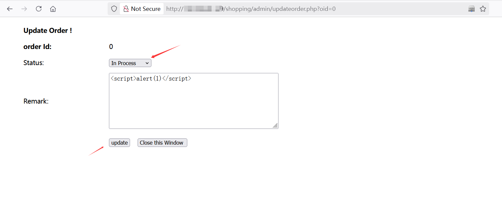

# Descrip
The PHPGurukul Online Shopping Portal Project version 2.1 contains a vulnerability that leads to Stored Cross-Site Scripting (XSS). An attacker can exploit this vulnerability to execute arbitrary JavaScript code in the context of a user's session, potentially leading to account takeover.

# Vulnerability Overview
1.Vulnerability Type: Stored Cross-Site Scripting (XSS)  
2.Affected Product: Online Shopping Portal Project - 2.1  
3.Affected Component: /shopping/admin/updateorder.php?oid=0  
4.Attack Type: Stored Cross-Site Scripting (XSS)

# Steps to Reproduce

1.Set Up the Application : Install and configure the vulnerable version (v2.1) on a local server. download from here  
``https://phpgurukul.com/shopping-portal-free-download/``  

2.Login to the System : Use the default credentials provided by phpgurukul.  
``admin/Test@123``  

3.Access the Vulnerable Functionality : /shopping/admin/updateorder.php?oid=0  
  
4.paste the below code into content and choose the Status 'In Process' then click update  
````  
  
  
  
4. Repeat into /shopping/admin/updateorder.php?oid=0  for a Stored Cross-Site Scripting (XSS)

